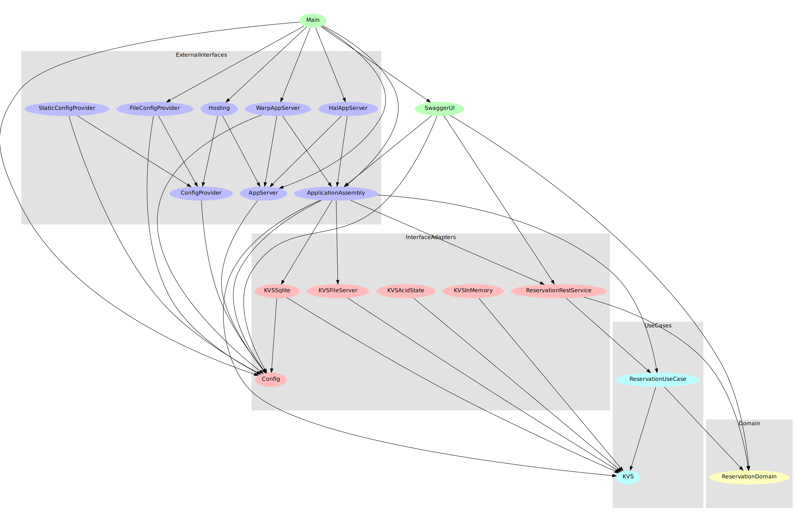

[](https://github.com/thma/PolysemyCleanArchitecture/actions)
<a href="https://github.com/thma/PolysemyCleanArchitecture"></a>


## Introduction

Welcome to yet another sequel of [Clean Architecture with Haskell and Polysemy](https://thma.github.io/posts/2020-05-29-polysemy-clean-architecture.html).

In my last to posts ([integration of Warp and Hal](https://thma.github.io/posts/2022-07-04-polysemy-and-warp.html) and [configuration of a polysemy app](https://thma.github.io/posts/2022-07-17-configuration-of-a-polysemy-app.html)) I was adding new features to my code base without caring much about one of the core rules of CleanArchitecture:

> The overriding rule that makes this architecture work is **The Dependency Rule**. 
> This rule says that source code dependencies can only point inwards.
> Nothing in an inner circle can know anything at all about something in an outer circle. 
> In particular, the name of something declared in an outer circle must not be mentioned by the code in the an inner circle. 
> That includes, functions, classes. variables, or any other named software entity.
>
> [Uncle Bob](https://blog.cleancoder.com/uncle-bob/2012/08/13/the-clean-architecture.html)

At one point for example I noticed that a piece of code in the InterfaceAdapters package references a module in the ExternalInterfaces package.

This mishap was easy to fix, but I thought about ways to visualize module dependencies and to automatically verify that all dependencies comply to the **dependency rule**.

In this post I'm writing about my findings.

## Visualizing Module dependencies with graphmod

Whenever I think I had a brilliant idea, the Internet keeps telling me that someone else already had the same idea years ago...

So before starting to write my own *Module Dependency Visualizer* tool, I asked the Internet if others already had the same idea.

And &ndash; not so surprisingly &ndash; I found [graphmod](https://github.com/yav/graphmod) by Iavor S. Diatchki. It outputs GraphViz DOT models and is able to scan quite complex Haskell code bases in decent time.

After installing it with 

```bash
cabal install graphmod
```

The following command generates a detailed view on the dependencies in the PolySemyCleanArchitecture project:

```bash
graphmod | dot -Tpdf > dependencies.pdf
```

Here is the output:



As required by the CleanArchitecture model all dependencies are directed inwards. No dependencies are going from inner layers to more outward layers.

Graphdot also provides additional flags to reduce clutter by pruning, to visualize the dependencies without package clustering, etc.  
You'll find a few examples in [the graphmod wiki](https://github.com/yav/graphmod/wiki).

## Automating CleanArchitecture dependency validation

Visually inspecting a code base in this way is great. But it still involves manual effort if we intend to re-evaluate this image after each code change.

Wouldn't it be much more adequate to provide a fully automated dependency check to be include in each CI/CD run?

